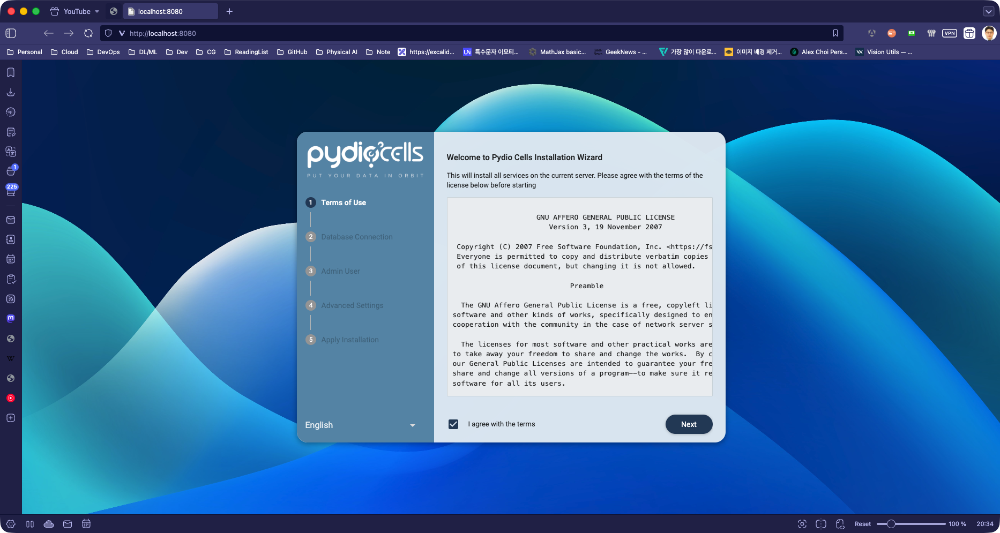
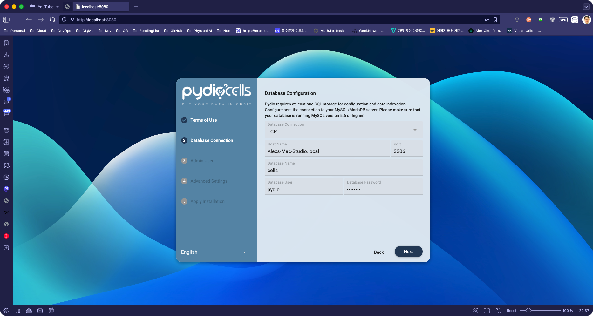
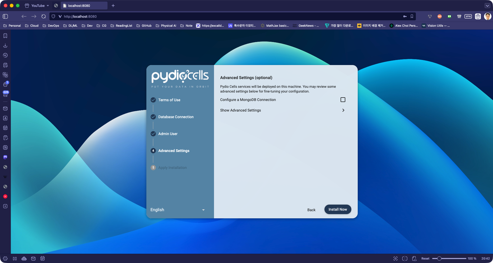
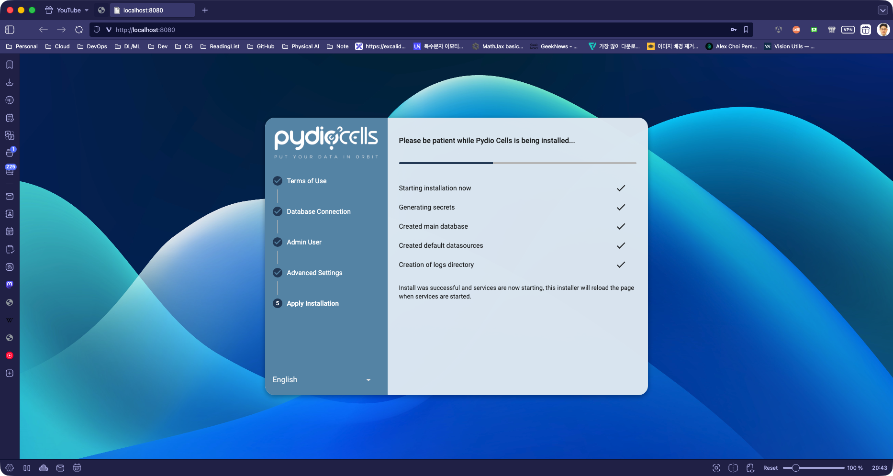
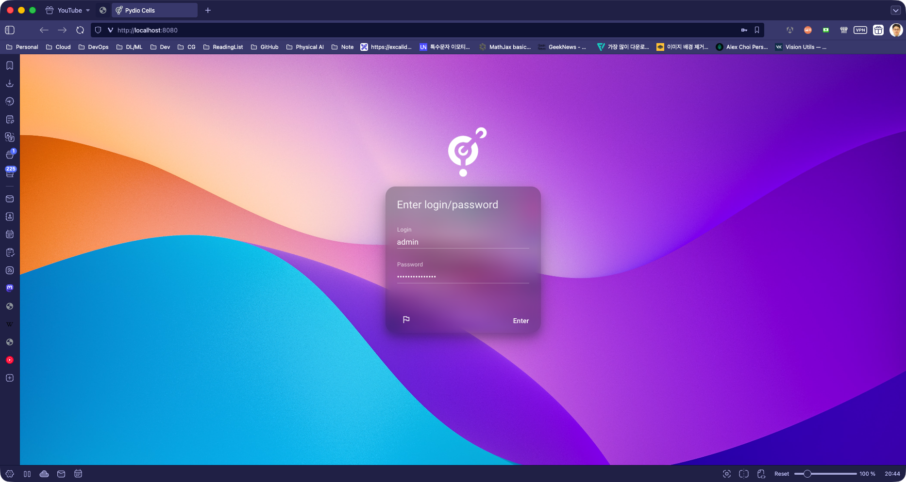
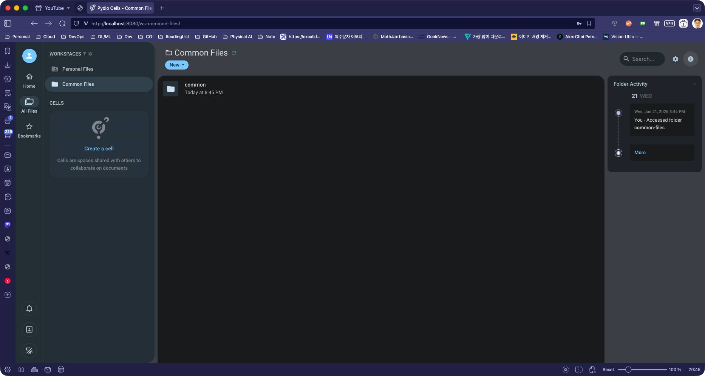

# Pydio Cells Deployment with Docker Compose Configuration

This is a Docker Compose configuration file for Pydio Cells, a powerful file management and collaboration platform.

## 1. Deploy Pydio with Docker Compose

```bash
$ docker compose up -d
```

## 2. Open Dashboard

```bash
$ mise run dashboard:open-dashboard
```

## 3. Configure on the Dashboard

- Check "I agree with the terms"
- Next



Get IP address (en0):

```bash
$ mise run dashboard:get-ipaddress-en0
192.168.0.85 # example hostname
```

If it does not work (no output), try with en1:

```bash
$ mise run dashboard:get-ipaddress-en1
192.168.0.86 # example hostname
```

- Database Connection: TCP
- HostName: {YOUR-IP-ADDRESS}
- Port: `3306`
- Database Name: `cells`
- Database User: `pydio`
- Password: `P@ssw0rd`



- Application Title: {YOUR-APPLICATION-TITLE}
- Default Language: `English`
- Admin password: {YOUR-ADMIN-PASSWORD}
- Confirm password: {YOUR-ADMIN-PASSWORD}


Install Now



Installation start



Login



## Clean Docker

Clean docker volume(folders). !!!RUN WITH CAUTION!!!

```bash
$ mise run docker:clean
```

Enjoy sharing files and collaborating with others!


